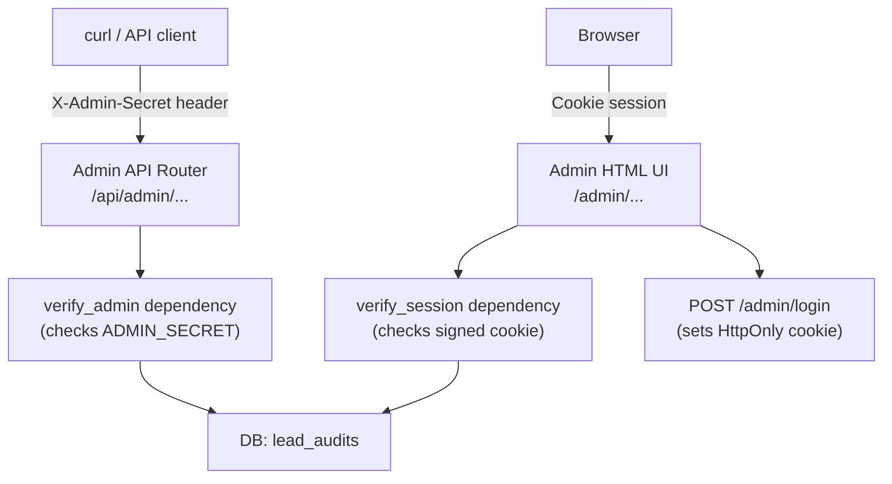

# Admin Audit Dashboard Plan

## Architecture Overview




## Key Files

- `[backend/app/config.py](backend/app/config.py)` — add `admin_secret` field
- `[backend/.env.example](backend/.env.example)` — document `ADMIN_SECRET`
- `backend/app/api/admin.py` — **new**: all admin routes (API + HTML)
- `backend/app/schemas/admin.py` — **new**: Pydantic response schemas
- `[backend/app/main.py](backend/app/main.py)` — mount admin router
- `backend/app/templates/admin/` — **new**: Jinja2 HTML templates (Day 2)

---

## Day 1 — Read-Only Admin API

### 1. Config (`config.py`)

Add one field:

```python
admin_secret: str = ""  # set via ADMIN_SECRET env var
```

### 2. Auth dependency (`app/api/admin.py`)

Use `X-Admin-Secret` header (never in URL/logs):

```python
def verify_admin(x_admin_secret: str = Header(...)):
    if not secrets.compare_digest(x_admin_secret, settings.admin_secret):
        raise HTTPException(403)
```

If `ADMIN_SECRET` is empty/unset, the dependency raises a 503 (disabled) to prevent accidental open access.

### 3. Admin API endpoints


| Method | Path                           | Description                                                         |
| ------ | ------------------------------ | ------------------------------------------------------------------- |
| `GET`  | `/api/admin/audits`            | Paginated list — email, url, status, created_at, updated_at         |
| `GET`  | `/api/admin/audits/{audit_id}` | Full detail — all fields incl. `report_markdown`, `page_audit_json` |
| `GET`  | `/api/admin/audits/export.csv` | StreamingResponse CSV — all rows, all lead columns                  |


Query params for list: `page` (default 1), `limit` (default 50, max 200), `status` filter.

### 4. Pydantic schemas (`app/schemas/admin.py`)

- `AdminAuditRow` — list item (no `report_markdown` / JSONB to keep response small)
- `AdminAuditDetail` — full row
- `AdminAuditListResponse` — `{ total, page, limit, items: [AdminAuditRow] }`

### 5. Mount in `main.py`

```python
from app.api.admin import router as admin_router
app.include_router(admin_router, prefix="")  # paths already include /api/admin or /admin
```

---

## Day 2 — Optional HTML Admin UI

### Auth strategy for browser

- `POST /admin/login` accepts `{ secret }` form field, validates against `ADMIN_SECRET`, sets a **signed HttpOnly cookie** (`admin_session`) using `itsdangerous.TimestampSigner` (already a transitive dep via FastAPI; add if not present).
- `verify_session` dependency reads/validates cookie; on failure redirects to `/admin/login`.
- Session TTL: 8 hours.

### Jinja2 templates

Mount `StaticFiles` isn't needed — Jinja2 via `fastapi.templating.Jinja2Templates`.


| Template      | Route                   | Content                                                                       |
| ------------- | ----------------------- | ----------------------------------------------------------------------------- |
| `login.html`  | `GET /admin/login`      | Minimal form, POST to `/admin/login`                                          |
| `list.html`   | `GET /admin`            | Table: email, URL, status badge, created_at, detail link                      |
| `detail.html` | `GET /admin/{audit_id}` | Full audit — rendered Markdown (`markdown` lib already in `requirements.txt`) |


All HTML pages include `<meta name="robots" content="noindex,nofollow">`.

### Logout

`POST /admin/logout` — deletes cookie, redirects to `/admin/login`.

---

## Security Notes

- `ADMIN_SECRET` checked via `secrets.compare_digest` (timing-safe).
- Cookie is `HttpOnly`, `SameSite=Lax`, `Secure` in production.
- HTML pages are not linked from any public marketing page.
- Recommend a random, long secret (e.g. `openssl rand -hex 32`).
- Optional: add `ADMIN_ALLOWED_IPS` env var later for IP allowlist.

## Rate Limiting

`POST /admin/login` is protected by `[slowapi](https://github.com/laurentS/slowapi)` (a Starlette/FastAPI wrapper around `limits`):

- **5 requests per minute per IP** → `429 Too Many Requests` on breach
- Keyed on `request.client.host` (real IP; behind a reverse proxy, configure `X-Forwarded-For` trust)

Setup in `main.py`:

```python
from slowapi import Limiter, _rate_limit_exceeded_handler
from slowapi.util import get_remote_address
from slowapi.errors import RateLimitExceeded

limiter = Limiter(key_func=get_remote_address)
app.state.limiter = limiter
app.add_exception_handler(RateLimitExceeded, _rate_limit_exceeded_handler)
```

Applied to the login endpoint in `app/api/admin.py`:

```python
@router.post("/admin/login")
@limiter.limit("5/minute")
async def admin_login(request: Request, ...):
    ...
```

Only the login endpoint is rate-limited; authenticated routes (list, detail, export) are not, since they require a valid session/header and don't have a guessable credential.

## `.env.example` addition

```
# Admin dashboard (keep secret — never commit the real value)
ADMIN_SECRET=change-me-use-openssl-rand-hex-32
```

## New dependencies

- `itsdangerous` — for signing the session cookie
- `slowapi` — rate limiting on the login endpoint

Both added to `requirements.txt`.