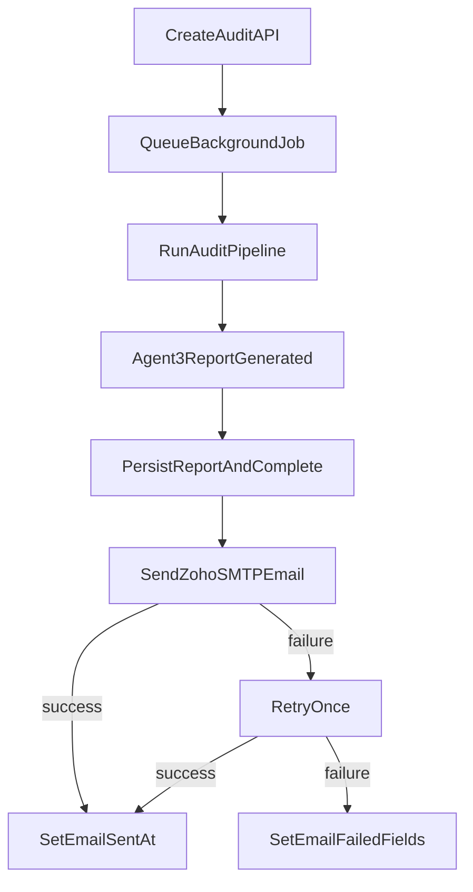

# Fulfill Lead Magnet Email Delivery (Zoho SMTP)

## Outcome

Ship a production-safe `audit complete -> email delivered` flow for the existing audit pipeline, with HTML rendering from Markdown, delivery/failure tracking, and waitlist conversion CTA.

## Current Insertion Point (confirmed)

The completion hook already exists in the pipeline job:

- `[c:/Users/Nadra/OneDrive/Documents/4 DEV/_projects/solvialabs-website/backend/app/jobs/run_audit.py](c:/Users/Nadra/OneDrive/Documents/4 DEV/_projects/solvialabs-website/backend/app/jobs/run_audit.py)`
- `[c:/Users/Nadra/OneDrive/Documents/4 DEV/_projects/solvialabs-website/backend/app/models/lead_audit.py](c:/Users/Nadra/OneDrive/Documents/4 DEV/_projects/solvialabs-website/backend/app/models/lead_audit.py)`
- `[c:/Users/Nadra/OneDrive/Documents/4 DEV/_projects/solvialabs-website/backend/sql/001_lead_audits.sql](c:/Users/Nadra/OneDrive/Documents/4 DEV/_projects/solvialabs-website/backend/sql/001_lead_audits.sql)`

## Implementation Plan

### 1) Provider config + SMTP transport (Day 1)

- Extend backend settings in `[c:/Users/Nadra/OneDrive/Documents/4 DEV/_projects/solvialabs-website/backend/app/config.py](c:/Users/Nadra/OneDrive/Documents/4 DEV/_projects/solvialabs-website/backend/app/config.py)`:
  - `smtp_host`, `smtp_port`, `smtp_username`, `smtp_password`, `smtp_from_email`, `smtp_from_name`, `smtp_use_tls`, optional `smtp_reply_to`.
- Add a transactional email service module (new file):
  - `backend/app/services/email_delivery.py` with a single `send_audit_email(...)` entrypoint.
  - Use Python stdlib `smtplib` + `email.message.EmailMessage` (no extra dependency required).
- Add environment validation helper to fail fast on missing SMTP vars before sending.

### 2) Markdown -> HTML pipeline + template (Day 2)

- Add Markdown rendering dependency in `[c:/Users/Nadra/OneDrive/Documents/4 DEV/_projects/solvialabs-website/backend/requirements.txt](c:/Users/Nadra/OneDrive/Documents/4 DEV/_projects/solvialabs-website/backend/requirements.txt)` (latest package-manager version).
- Create renderer + template module (new file):
  - `backend/app/services/audit_email_template.py`.
  - Build multipart email:
    - **Plain text part** from original markdown (plus key links).
    - **HTML part** with: branded header, summary section, action section, footer.
- Footer/legal content:
  - Include link to privacy policy: `[c:/Users/Nadra/OneDrive/Documents/4 DEV/_projects/solvialabs-website/privacy-policy.html](c:/Users/Nadra/OneDrive/Documents/4 DEV/_projects/solvialabs-website/privacy-policy.html)`.
  - Include a transactional-context line ("You received this because you requested a website audit") plus contact email.
  - Add an unsubscribe/preferences line only if legal review requires it for this transactional message class.
- CTA setup:
  - Primary CTA -> waitlist URL (as requested).

### 3) Trigger on Agent 3 success + audit state updates

- Update completion path in `[c:/Users/Nadra/OneDrive/Documents/4 DEV/_projects/solvialabs-website/backend/app/jobs/run_audit.py](c:/Users/Nadra/OneDrive/Documents/4 DEV/_projects/solvialabs-website/backend/app/jobs/run_audit.py)`:
  - After report generation and successful persistence, call `send_audit_email(...)`.
  - Record success timestamp on the audit row (`email_sent_at`).
- Extend audit model + SQL migration:
  - Add `email_sent_at`, `email_failed_at`, `email_error_message`, `email_attempts` (default 0).
  - Keep existing `status="complete"` for audit generation state; track delivery with separate email fields.

### 4) Failure handling + single retry

- In `run_audit.py`, wrap send in guarded flow:
  - Attempt send once.
  - On first failure, retry once after short delay/jitter.
  - If still failing, persist `email_failed_at`, `email_error_message`, increment attempts, and log structured context (`audit_id`, recipient, provider response class).
- Optionally surface `email_failed` in status/admin path:
  - Extend response schema in `[c:/Users/Nadra/OneDrive/Documents/4 DEV/_projects/solvialabs-website/backend/app/schemas/audit.py](c:/Users/Nadra/OneDrive/Documents/4 DEV/_projects/solvialabs-website/backend/app/schemas/audit.py)` and route in `[c:/Users/Nadra/OneDrive/Documents/4 DEV/_projects/solvialabs-website/backend/app/api/v1.py](c:/Users/Nadra/OneDrive/Documents/4 DEV/_projects/solvialabs-website/backend/app/api/v1.py)` with delivery fields (or add an admin-only endpoint if preferred).

### 5) Verification checklist

- SMTP handshake and authenticated send succeeds from backend runtime.
- Completed audit transitions to `status=complete` and sets `email_sent_at`.
- Simulated SMTP failure sets `email_failed_at` + `email_error_message` after one retry.
- Email renders correctly in common clients (Gmail + Outlook web quick check).
- Footer links and legal wording align with privacy/compliance review.

## Delivery Sequence

## Risk Assessment

- Deliverability risk (SPF/DKIM/DMARC or mailbox reputation): mitigate with domain authentication + warmed sender identity.
- Duplicate sends on process restarts: mitigate with `email_sent_at` guard + idempotent check before send.
- HTML client quirks: keep template table-lite, inline styles, and always include plaintext alternative.
- SMTP transient failures: one bounded retry with clear persistent failure markers for operations follow-up.
- Compliance ambiguity (transactional vs marketing): keep message transactional by default and route any opt-out/legal expansion through privacy review.

