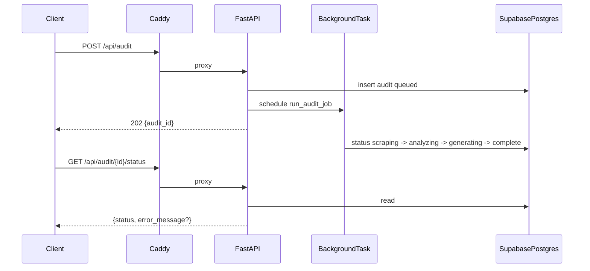

# Phase 1: Backend API, Supabase Postgres, and VPS wiring

## Why Supabase (vs SQLite on the VPS)

You already use Supabase for the Solvia web app. **Using Supabase for this lead-magnet API is recommended** because:

- **One operational surface:** audits, emails, and future report blobs live next to your app data; backups and retention follow Supabase.
- **Visibility before Phase 5:** Table Editor and SQL in the dashboard replace ad-hoc SQLite file access on the server.
- **Postgres features:** JSON/JSONB columns for `page_audit` / `serp_analysis` in Phase 2 without shoehorning into SQLite.
- **No DB files on the VPS:** Deploys only restart the API; no path discipline for `*.db` under `/opt/solvia`.

**Trade-offs:** the VPS must allow **outbound HTTPS** to Supabase; cold starts and pool settings matter slightly more than a local file. Use the **connection pooler** URL (Supavisor / pooler port) for serverless-ish patterns; for a single long-lived Uvicorn process, direct or pooler both work—follow Supabase docs for SQLAlchemy.

**Optional:** reuse the **same Supabase project** as the web app with a dedicated table `**lead_audits`** and service-role DB access from FastAPI only. Use a **separate project** only if you need hard isolation or billing separation.

## Context

- The site is a static Jekyll build in `[index.html](index.html)` deployed to `/opt/solvia/landing` via `[/.github/workflows/deploy.yml](.github/workflows/deploy.yml)`. There is **no Caddyfile in-repo**; reverse proxy rules live on the server.
- Phase 1 only: **no** Firecrawl, LLM, SERP, email, or admin UI—only API skeleton, persistence, and a **stub** background worker that transitions statuses so the contract is real.

## Architecture

## 1. Repo layout and dependencies

Create `[backend/](backend/)` with:

| Item                                   | Purpose                                                                                                                                                        |
| -------------------------------------- | -------------------------------------------------------------------------------------------------------------------------------------------------------------- |
| `pyproject.toml` or `requirements.txt` | `fastapi`, `uvicorn[standard]`, `sqlalchemy`, `psycopg` (or `psycopg2-binary`), `pydantic-settings` (or `python-dotenv`), `alembic` (recommended for Postgres) |
| `app/main.py`                          | FastAPI app factory, CORS (restrict to `https://solvia.app` in prod via env)                                                                                   |
| `app/api/routes.py`                    | Routers under prefix `/api`                                                                                                                                    |
| `app/models/`                          | SQLAlchemy `Audit` model                                                                                                                                       |
| `app/schemas/`                         | Pydantic request/response for audit and status                                                                                                                 |
| `app/db.py`                            | Engine/session, `get_db` dependency                                                                                                                            |
| `app/jobs/audit_stub.py`               | Background task: sleep + status updates (simulates Phase 2)                                                                                                    |
| `.env.example`                         | `DATABASE_URL` (Postgres URI from Supabase), `CORS_ORIGINS`, placeholder API keys for later phases                                                             |

`**DATABASE_URL`:** Use the Supabase **Settings → Database** connection string (prefer **Transaction** pooler for compatibility with many short-lived connections; for one Uvicorn worker, **Session** mode or direct URI is also fine). Format: `postgresql+psycopg://...` or `postgresql://...` per SQLAlchemy 2.x driver choice.

**Security:** Only the FastAPI process on the VPS holds DB credentials (service role or a dedicated Postgres user limited to `lead_audits`). Never expose DB URL to the browser. If you use Supabase **RLS**, the API must use a role that bypasses RLS for server-side writes (e.g. service role) or policies that allow insert/update from trusted backend only—simplest for Phase 1 is **server-only credentials + RLS disabled for this table** or policies scoped to service role.

**Local dev:** Point `DATABASE_URL` at the same Supabase project (dev branch / staging) or a local Postgres; optional SQLite fallback is not required if you always use Supabase dev DB.

**Git:** Add `.gitignore` entries for `backend/.venv`, `__pycache__`, `.env` if not already present.

## 2. API contract (versioned)

- `GET /api/health` — returns `{"status":"ok"}` (used by deploy smoke checks and monitoring).
- `POST /api/v1/audit` — body `{ "url": "https://...", "email": "..." }`  
  - Validate URL scheme (`http`/`https`), reasonable length, basic email format.  
  - Create row with `status=queued`, return `202 Accepted` with `{ "audit_id": "<uuid>", "status": "queued" }` (or `201` if you prefer; document choice).
- `GET /api/v1/audit/{audit_id}/status` — returns `{ "audit_id", "status", "error_message": null | string }`  
  - Status enum: `queued`, `scraping`, `analyzing`, `generating`, `complete`, `failed`.

**Background execution:** Use FastAPI `BackgroundTasks` to call `run_audit_stub(audit_id)` after commit. The stub cycles statuses with short `asyncio.sleep` delays and sets `failed` on intentional exception path (or leave one test hook). **Do not** run the real pipeline in the request thread.

**Schema placeholders:** Add nullable columns on `Audit` for future phases: e.g. `report_markdown`, `page_audit_json`, `serp_analysis_json` (TEXT/JSON), or a single `report_json` blob—enough for Phase 2 to fill without another migration if you use Alembic from the start or a single `create_all` with additive columns.

## 3. Database (Supabase)

- **Table:** `**lead_audits`** with columns: `id` (UUID PK), `url`, `email`, `status`, `error_message`, `created_at`, `updated_at`, nullable JSON/text columns for future `report_markdown` / structured outputs.
- **Migrations:** Prefer **Alembic** (revision checked in) or a one-time SQL migration applied in Supabase SQL Editor so production schema is explicit. Avoid `create_all()` in production without review.
- **Indexes:** PK on `id`; index on `created_at` for later admin listing.
- **Same project as main app:** Use the agreed name `lead_audits` to avoid collisions with existing tables.

## 4. VPS: systemd

Document (and optionally add a `deploy/` or `docs/` script snippet) for:

- User: `root` or dedicated `solvia` user (no local DB directory required when using Supabase).
- Unit file e.g. `/etc/systemd/system/solvia-audit-api.service`:  
`WorkingDirectory=/opt/solvia-site/backend`, `EnvironmentFile=/opt/solvia-site/backend/.env`, `ExecStart=/opt/solvia-site/backend/.venv/bin/uvicorn app.main:app --host 127.0.0.1 --port 8000` (port configurable).

## 5. VPS: Caddy

Add **server-side** instructions (not committed if not in repo): `reverse_proxy /api/* 127.0.0.1:8000` (or path prefix `/api` to FastAPI with `root_path` if needed—see FastAPI docs). Ensure static site for `/` remains unchanged. Verify: `curl https://solvia.app/api/health`.

## 6. CI/CD alignment

Extend `[deploy.yml](.github/workflows/deploy.yml)` **or** a separate `README` section:

1. After `git pull` on server: `cd /opt/solvia-site/backend && python3 -m venv .venv && .venv/bin/pip install -r requirements.txt` (or idempotent `pip sync`).
2. `systemctl restart solvia-audit-api` (or `reload` if supported).
3. Extend verification step: `curl` to `https://solvia.app/api/health` expecting 200.

**Note:** Jekyll build: current workflow only rsyncs `_site/` from the repo; if `_site` is built in CI or locally, ensure backend folder is not excluded from the clone. No change to Jekyll needed for Phase 1.

## 7. Documentation

Update `[README.md](README.md)` with a short subsection: local run (`uvicorn`), env vars (`DATABASE_URL`, `CORS_ORIGINS`), Supabase table setup, and VPS checklist (systemd + Caddy).

## Deliverables checklist

- FastAPI app with `/api/health`, `/api/v1/audit`, `/api/v1/audit/{id}/status`
- Supabase Postgres persistence with status lifecycle and stub job (row visible in Table Editor)
- `.env.example` + production guidance (no secrets in git)
- systemd + Caddy documentation (and optional deploy workflow hooks); VPS egress to Supabase confirmed
- Smoke test: create audit → poll until `complete` → row exists in Supabase

## Risks (from PRD, mapped to implementation)

- **Caddy misconfiguration:** Document minimal diff; test `/api/health` before merging proxy for all traffic.
- **Supabase connectivity:** API returns 5xx if DB URL wrong or firewall blocks egress—mitigate with health check that optionally pings DB, and clear logs without printing `DATABASE_URL`.
- **Connection pool limits:** Too many Uvicorn workers × connections can exhaust pool—start with **one worker** for Phase 1; use pooler URI and `pool_size` limits per SQLAlchemy docs.
- **Secrets:** `.env` only on server; `pydantic-settings` for loading; never log full env or service role key.

