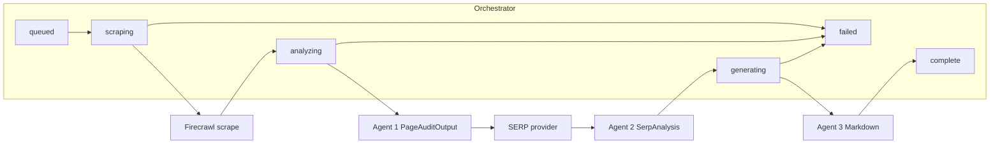

# Phase 2: URL → structured JSON + Markdown audit pipeline

## Current baseline

- **API:** `[POST /api/v1/audit](backend/app/api/v1.py)` enqueues `[run_audit_stub](backend/app/jobs/audit_stub.py)` via FastAPI `BackgroundTasks`.
- **DB:** `[LeadAudit](backend/app/models/lead_audit.py)` already has `report_markdown`, `page_audit_json`, `serp_analysis_json` (JSONB). No migration required for Phase 2 payloads unless you add columns for caching (optional below).
- **Status contract (Phase 1):** `queued` → `scraping` → `analyzing` → `generating` → `complete` | `failed` ([phase 1 plan](.cursor/plans/phase_1_backend_foundation_ada3ea56.plan.md)).
- **Config:** `[Settings](backend/app/config.py)` today only has `database_url` and `cors_origins`; Phase 2 extends this with Firecrawl, Gemini, Google CSE, timeouts, and optional token caps.

### Required environment variables (Google — exact names)

Implementation must use **only** these env vars for LLM and SERP (no parallel aliases such as `SERPER_API_KEY` unless a second provider is added later):

| Env var              | Purpose                                                                                            |
| -------------------- | -------------------------------------------------------------------------------------------------- |
| `GOOGLE_API_KEY`     | Gemini API key (`google-generativeai` / `genai.configure(api_key=...)`)                            |
| `GEMINI_MODEL`       | Model id passed to `GenerativeModel(...)` (e.g. `gemini-2.0-flash`) — never hardcode in agent code |
| `GOOGLE_CSE_API_KEY` | Google Custom Search JSON API **key** query param (`key=`)                                         |
| `GOOGLE_CSE_ID`      | Programmable Search Engine id (`cx` query param)                                                   |

Pydantic field names: `google_api_key`, `gemini_model`, `google_cse_api_key`, `google_cse_id`. **Do not** use `GOOGLE_API_KEY` for Custom Search requests; CSE uses `GOOGLE_CSE_API_KEY` only.

## Target architecture

**Status mapping (reuse Phase 1 enum):**

| DB `status`  | Stage                                                                                                                                    |
| ------------ | ---------------------------------------------------------------------------------------------------------------------------------------- |
| `scraping`   | Firecrawl request + normalize payload                                                                                                    |
| `analyzing`  | Agent 1 (page) + SERP HTTP + Agent 2 (SERP) — sequential inside one status to avoid a migration; log sub-step timing in application logs |
| `generating` | Agent 3 Markdown assembly                                                                                                                |
| `complete`   | Commit `report_markdown` + JSON blobs                                                                                                    |

If you later need finer-grained polling (e.g. separate “SERP” step), add new `status` values + a small SQL migration and extend `[AuditStatusResponse](backend/app/schemas/audit.py)` literals/docs.

---

## 1. Agreed JSON schemas (Pydantic source of truth)

There are **no** `PageAuditOutput` / `SerpAnalysis` types in the repo yet. Add dedicated modules, e.g.:

- `[backend/app/schemas/page_audit.py](backend/app/schemas/page_audit.py)` — `PageAuditOutput`
- `[backend/app/schemas/serp_analysis.py](backend/app/schemas/serp_analysis.py)` — `SerpAnalysis`

**Suggested field groups** (align names with your product spec; adjust in implementation):

- **PageAuditOutput:** `url`, `title`, `meta` (description, canonical, robots, og/twitter if present), `headings` (h1–h6 counts or structured list), `word_count`, `internal_links` / `external_links` (counts + samples), `technical` (viewport, charset, lang, approximate response hints if available from scrape), `primary_keyword` / `secondary_keywords`, `search_intent` (enum), `notes` / `signals` as needed.
- **SerpAnalysis:** `primary_keyword`, `serp_results` (title, url, snippet rank), `patterns` (synthesis string or bullets), `people_also_ask` (if API returns), `opportunities` (list), optional `provider_metadata`.

Export from `[backend/app/schemas/__init__.py](backend/app/schemas/__init__.py)` for clean imports.

**Validation:** parse LLM output with `model_validate_json` / `model_validate`; on failure, one **repair** pass (second LLM call: “fix JSON to match schema”) or truncate-and-retry with a smaller chunk — keep this in one helper to avoid scattered error handling.

---

## 2. Firecrawl integration

- Add official SDK dependency (e.g. `firecrawl-py` per Firecrawl docs) and `**httpx`-compatible timeouts** around the client call.
- Request **formats** that match the spec: `markdown`, `html`, and **links** (or equivalent fields returned by the API — map into your internal structure before Agent 1).
- **Retries:** limited exponential backoff for transient 5xx / rate limits; cap total time with `asyncio.wait_for` or a deadline checked between retries.
- **Failure:** set `status=failed`, `error_message` user-safe (no stack traces), log server-side detail.

Implement in a thin service module, e.g. `[backend/app/services/firecrawl.py](backend/app/services/firecrawl.py)`, returning a small **DTO** (markdown, html, links list, final URL after redirects if exposed).

---

## 3. Agent 1 — page audit

- **Deterministic layer:** compute title from HTML, meta tags, heading tree, word count from markdown/plain text, classify links internal vs external using the page’s origin, collect technical signals from HTML.
- **LLM layer:** infer primary/secondary keywords and search intent from title + headings + excerpt; keep prompts versioned under e.g. `[backend/app/prompts/](backend/app/prompts/)` (plain text or Python strings).
- **Output:** single structured object matching `PageAuditOutput`; validate before persisting to `page_audit_json`.

---

## 4. SERP provider + Agent 2

- **Provider abstraction:** `[backend/app/services/serp.py](backend/app/services/serp.py)` with one implementation first (e.g. **Serper** or **SerpAPI** — choose based on pricing/features; both expose organic results; PAA varies). Interface: `search(query: str) -> raw dict`.
- **Agent 2:** consume raw SERP + **primary keyword from Agent 1**; LLM produces `SerpAnalysis` (patterns, opportunities, PAA if present in raw payload). Validate → `serp_analysis_json`.
- **Cost control:** cache keyword + raw SERP in memory per run only; optional future: store `serp_raw_json` column — **out of scope** unless you add a migration; for Phase 2, logging hashed query + result count is enough for debugging.

---

## 5. Agent 3 — Markdown report

- **Inputs:** validated `PageAuditOutput` + `SerpAnalysis` + optional scrape summary.
- **Sections:** executive summary; technical signals table; keyword / intent; competitive / SERP section; prioritized recommendations **P0 / P1 / P2** with **effort** and **impact** (plain Markdown, email-friendly — no HTML email templating per scope).
- **Output:** single string → `report_markdown`.

---

## 6. Orchestrator

- Replace `[run_audit_stub](backend/app/jobs/audit_stub.py)` with e.g. `**run_audit_pipeline(audit_id: UUID)`** in `[backend/app/jobs/run_audit.py](backend/app/jobs/run_audit.py)` (or rename module).
- **Flow:** load row → `scraping` → Firecrawl → `analyzing` → Agent 1 → SERP → Agent 2 → `generating` → Agent 3 → write `page_audit_json`, `serp_analysis_json`, `report_markdown` → `complete`.
- **Timeouts:** per-stage timeouts via settings (`SCRAPE_TIMEOUT_SEC`, `LLM_TIMEOUT_SEC`, `SERP_TIMEOUT_SEC`); overall job ceiling optional.
- **Errors:** any unhandled exception → `failed` + `error_message`; ensure DB session rollback-safe (pattern already in stub).
- **Wire-up:** `[create_audit](backend/app/api/v1.py)` calls the new job instead of `run_audit_stub`.

---

## 7. Configuration and dependencies

- Extend `[backend/app/config.py](backend/app/config.py)`: `firecrawl_api_key`, `llm_api_key` + `llm_provider` + `llm_model`, `serp_api_key` + `serp_provider`, timeout integers, optional `llm_max_tokens` / budget caps.
- Update `[backend/.env.example](backend/.env.example)` with placeholders (no secrets).
- Update `[backend/requirements.txt](backend/requirements.txt)`: Firecrawl SDK, LLM SDK (OpenAI and/or Anthropic — pick one primary), `httpx`, `tenacity` (retries), optional `instructor` if you adopt it for structured outputs.

---

## 8. Testing

- **Unit tests** with **mocked** Firecrawl, SERP, and LLM responses (fixed JSON strings) to assert orchestration order and DB writes.
- **Manual smoke:** 2–3 URLs (static blog, JS-heavy page, your domain) against real APIs in a dev project with budget caps.

---

## Risk alignment (from your table)

| Risk                | Implementation note                                                               |
| ------------------- | --------------------------------------------------------------------------------- |
| Firecrawl slow/fail | Timeouts, retries, clear `failed` status                                          |
| SERP cost           | Single query per audit; configurable provider; monitor usage                      |
| LLM JSON drift      | Schema validation + one repair retry; smaller focused calls                       |
| Keyword mismatch    | Prompts that anchor on page title/H1; sanity-check keyword vs URL path in Agent 1 |

---

## Deliverables checklist

- Firecrawl + deterministic + LLM **Agent 1** → `PageAuditOutput` validated and stored.
- SERP + **Agent 2** → `SerpAnalysis` validated and stored.
- **Agent 3** Markdown → `report_markdown`.
- Orchestrator replaces stub; statuses drive Phase 3 polling unchanged.
- `.env.example` + settings + tests with mocks.

