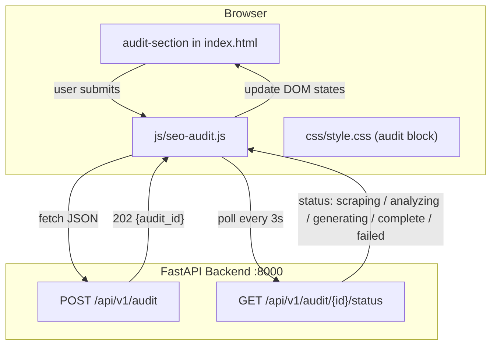

# Phase 3: Homepage Lead Magnet UI

## Architecture




## Status lifecycle (polling map)


| Backend `status` | UI copy shown                            |
| ---------------- | ---------------------------------------- |
| `queued`         | Getting ready...                         |
| `scraping`       | Scraping your website...                 |
| `analyzing`      | Analyzing SEO signals...                 |
| `generating`     | Writing your report...                   |
| `complete`       | Your report is on its way!               |
| `failed`         | Something went wrong — please try again. |


## API contract

- `POST /api/v1/audit` — body `{ url, email }`, responds `{ audit_id, status: "queued" }` (202)
- `GET /api/v1/audit/{audit_id}/status` — responds `{ audit_id, status, error_message }`
- URL must start with `http://` or `https://` (validated server-side too)
- API base URL: **same-origin** (`/api/v1/...`) — works both locally (with a reverse proxy or CORS allow) and in production

## Files to change

- `[index.html](index.html)` — **replace** the entire `<section class="product-hero">` block (lines 61–109) with `<section id="seo-audit-section">`; the existing hero (H1, USP list, Typeform buttons, hero image) is removed
- `[css/style.css](css/style.css)` — append audit section styles at the end (no changes to existing rules)
- `[js/seo-audit.js](js/seo-audit.js)` — new file; `<script>` tag added at bottom of `index.html`

## Visual design reference

Heavily inspired by the Firecrawl hero input (reference image provided). Key traits to replicate:

- **Section background:** plain white (`#fff`) — no grid, no dot pattern, no decorative elements
- **Centered layout:** headline + subhead center-aligned, max-width ~640px; the input card below is a self-contained pill/card
- **Eyebrow pill:** small rounded badge `Free · 2 min` above the headline (dark bg, white text, like Firecrawl's "2 Months Free" pill)
- **Headline:** large Poppins bold, two lines; key phrase in brand orange `#EC6019`
- **Input card:** single wide pill-shaped container (`border-radius: 999px` on outer wrapper, or a rounded card) containing:
  - Globe SVG icon left of URL field
  - URL `<input>` (no visible border, transparent bg inside card)
  - Email `<input>` separated by a `|` divider or stacked row on mobile
  - Orange arrow button `→` flush right (circle, `background: #EC6019`)
- **Error messages:** appear below the card, not inline, in `#ef4444`
- **Progress / success / failure states:** replace card content in place (no layout shift)

## Section HTML structure (index.html)

```html
<section id="seo-audit-section" class="audit-section">
  <div class="container">
    <div class="audit-hero">
      <!-- eyebrow pill -->
      <span class="audit-eyebrow-pill">Free · 2 min</span>

      <h2 class="audit-headline">
        See exactly what's<br>
        <span class="audit-headline-accent">holding your site back</span>
      </h2>
      <p class="audit-subhead">Enter your URL — we'll send a full SEO audit to your inbox.</p>

      <!-- Firecrawl-style pill input card -->
      <form id="audit-form" class="audit-form" novalidate aria-label="Free SEO audit">
        <div class="audit-input-card" id="audit-input-card">
          <!-- URL row -->
          <div class="audit-input-row">
            <svg class="audit-globe-icon" ...><!-- globe SVG --></svg>
            <label for="audit-url" class="sr-only">Website URL</label>
            <input id="audit-url" name="url" type="url"
                   class="audit-input" placeholder="https://yourwebsite.com"
                   autocomplete="url" required />
          </div>
          <!-- divider -->
          <div class="audit-input-divider" aria-hidden="true"></div>
          <!-- Email row -->
          <div class="audit-input-row">
            <svg class="audit-mail-icon" ...><!-- mail SVG --></svg>
            <label for="audit-email" class="sr-only">Email address</label>
            <input id="audit-email" name="email" type="email"
                   class="audit-input" placeholder="you@company.com"
                   autocomplete="email" required />
          </div>
          <!-- CTA arrow button -->
          <button type="submit" id="audit-submit" class="audit-submit-btn" aria-label="Get my free SEO audit">
            <svg ...><!-- arrow right --></svg>
          </button>
        </div>
        <!-- error messages below card -->
        <p class="audit-field-error" id="audit-url-error" role="alert" hidden></p>
        <p class="audit-field-error" id="audit-email-error" role="alert" hidden></p>
        <p class="audit-disclaimer">No spam. Unsubscribe anytime.</p>
      </form>

      <!-- Progress state -->
      <div id="audit-progress" class="audit-progress" hidden aria-live="polite">
        <div class="audit-steps">
          <span class="audit-step" data-step="scraping">Scraping your website</span>
          <span class="audit-step" data-step="analyzing">Analyzing SEO signals</span>
          <span class="audit-step" data-step="generating">Writing your report</span>
        </div>
        <p class="audit-progress-note">This takes 1–2 minutes. We'll email you when it's ready.</p>
      </div>

      <!-- Success state -->
      <div id="audit-success" class="audit-success" hidden>
        <p class="audit-success-heading">Your report is on its way!</p>
        <p class="audit-success-body">Check your inbox — your full SEO audit will arrive shortly.</p>
      </div>

      <!-- Failure state -->
      <div id="audit-error-global" class="audit-error" hidden role="alert">
        <p>Something went wrong. Please try again or contact us.</p>
      </div>
    </div>
  </div>
</section>
```

## CSS additions (css/style.css)

Append to the end of the file. Key rules:

- `.audit-section` — `background: #fff`, `padding: 100px 0`
- `.audit-hero` — `text-align: center`, `max-width: 640px`, `margin: 0 auto`
- `.audit-eyebrow-pill` — dark pill (`background: #1F2937`, `color: #fff`, `border-radius: 999px`, `padding: 4px 14px`, `font-size: 0.8rem`)
- `.audit-headline` — Poppins bold, `font-size: clamp(2rem, 5vw, 2.75rem)`; `.audit-headline-accent` — `color: #EC6019`
- `.audit-input-card` — `display: flex`, `align-items: center`, `background: #fff`, `border-radius: 999px`, `box-shadow: 0 4px 24px rgba(0,0,0,0.10)`, `padding: 6px 6px 6px 20px`, `gap: 8px`, `margin-top: 32px`; on mobile (`< 640px`) switches to `flex-direction: column`, `border-radius: 16px`, `padding: 16px`
- `.audit-input` — `flex: 1`, `border: none`, `outline: none`, `background: transparent`, `font-size: 1rem`, `padding: 10px 0`
- `.audit-input-divider` — `width: 1px`, `height: 28px`, `background: #E5E7EB`; hidden on mobile
- `.audit-submit-btn` — `width: 48px`, `height: 48px`, `border-radius: 50%`, `background: #EC6019`, `border: none`, `cursor: pointer`, `display: flex`, `align-items: center`, `justify-content: center`; hover `background: #d45516`; disabled `opacity: 0.6`
- `.audit-step` — pill tag style, muted grey; `.audit-step.active` — `background: #FFF7ED`, `color: #EC6019`, pulse animation
- `.audit-field-error` — `color: #ef4444`, `font-size: 0.85rem`, `margin-top: 8px`, centered

## JS logic (js/seo-audit.js)

```javascript
// Key logic outline — actual implementation in agent mode
const API_BASE = '/api/v1';
const POLL_INTERVAL_MS = 3000;
const MAX_POLL_ATTEMPTS = 60; // 3 min timeout

const STEP_ORDER = ['queued', 'scraping', 'analyzing', 'generating'];

async function submitAudit(url, email) { /* POST /api/v1/audit */ }
async function pollStatus(auditId) { /* GET .../status every 3s */ }
function setStep(status) { /* highlight correct .audit-step */ }
function showProgress() { /* hide form, show #audit-progress */ }
function showSuccess() { /* hide progress, show #audit-success */ }
function showFailure(msg) { /* show #audit-error */ }

// Validation: URL must start http/https; email basic regex
// Duplicate submit: disable button on submit, re-enable on failure
```

- On submit: validate → `POST` → on 202 store `audit_id` → show progress → start polling
- On poll `complete`: `clearInterval` → `showSuccess()`
- On poll `failed` or network error: `showFailure()`
- After `MAX_POLL_ATTEMPTS` with no terminal status: show "Taking longer than expected — check your email."
- All `fetch` calls include `Content-Type: application/json`

## Placement in index.html

The `<section class="product-hero">` block (lines 61–109) is fully removed and replaced in-place with `<section id="seo-audit-section">`. The lead magnet becomes the first section after the navbar — the primary above-the-fold moment. Add `<script src="js/seo-audit.js"></script>` before the closing `</body>` (after existing scripts on line ~506).

## CORS consideration

The Jekyll site and FastAPI run on different ports locally (4000 vs 8000). The backend already has `cors_origins` in `Settings`. For local dev, add `http://localhost:4000` to `CORS_ORIGINS` in `backend/.env`. In production both are served from the same domain so same-origin applies.